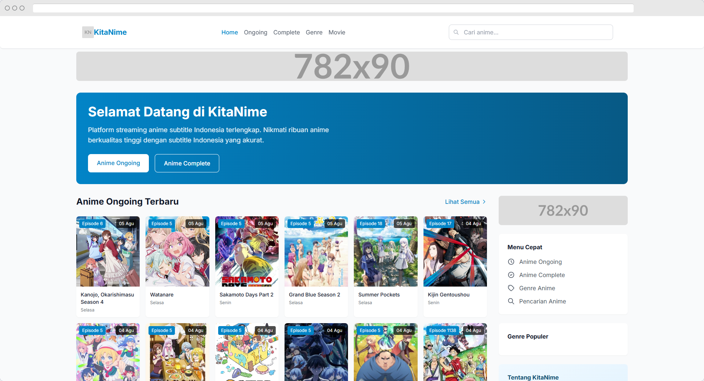
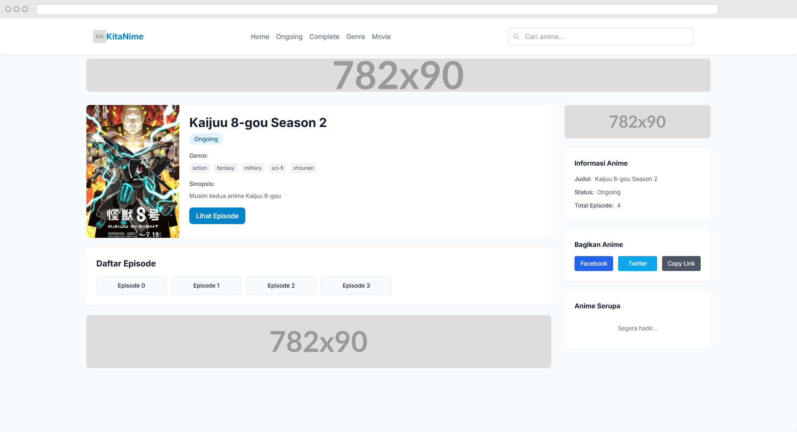
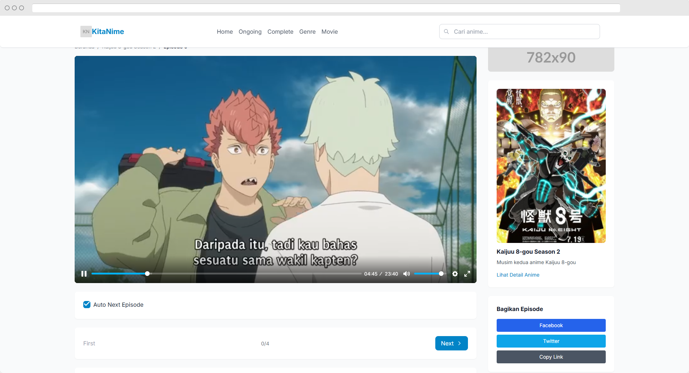
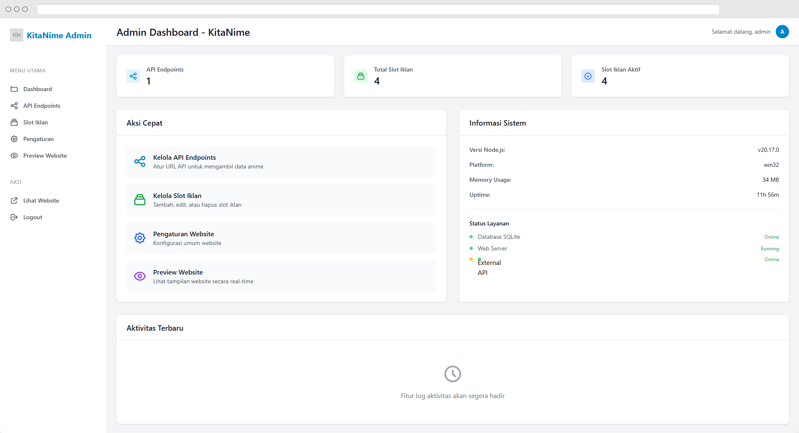

# 🎌 KitaNime - Anime Streaming Platform

     

> KitaNime adalah platform streaming anime modern dengan subtitle Indonesia yang menyediakan ribuan anime berkualitas tinggi. Dilengkapi dengan sistem scraping otomatis, admin panel yang powerful, dan antarmuka yang responsif untuk pengalaman menonton anime terbaik.

## ✨ Fitur Utama

🎬 **Streaming Anime**
- Ribuan anime dengan subtitle Indonesia
- Kualitas video HD (480p, 720p, 1080p)
- Player video yang responsif dengan kontrol lengkap
- Autoplay Next Episode & Resume video pada episode berikutnya

📱 **Antarmuka Modern**
- Desain responsif untuk semua perangkat
- Navigasi yang intuitif dan user-friendly
- Search dan filter anime yang canggih

🔄 **Sistem Scraping**
- Scraping otomatis dari sumber terpercaya
- Update anime ongoing secara real-time
- Manajemen episode dan batch download

⚙️ **Admin Panel**
- Dashboard admin yang komprehensif
- Manajemen API endpoints
- Sistem iklan terintegrasi
- Monitoring dan analytics

## 🖼️ Preview Aplikasi

> Preview dari KitaNime Anime Streaming Platform






## 🧩 Teknologi yang Digunakan

### Frontend
- **View Engine**: Pug templating untuk rendering HTML yang elegan
- **Styling**: Tailwind CSS untuk desain yang modern dan responsif
- **JavaScript**: Vanilla JS dengan Plyr untuk video player
- **Icons**: SVG icons dan custom graphics

### Backend
- **Server**: Node.js + Express.js untuk performa tinggi
- **Database**: SQLite3 untuk penyimpanan data yang efisien
- **Authentication**: bcrypt untuk keamanan password
- **Session**: Express-session untuk manajemen user
- **Security**: Helmet.js untuk keamanan HTTP headers

### API & Scraping
- **HTTP Client**: Axios untuk API requests
- **Web Scraping**: Cheerio untuk parsing HTML
- **Data Processing**: Custom utilities untuk data transformation
- **Caching**: Built-in response caching system

## 🏗️ Arsitektur Sistem

KitaNime terdiri dari dua komponen utama:

### 📺 Frontend Application (`/page`)
- Web interface untuk user
- Admin panel untuk manajemen
- Video streaming dan player
- Search dan navigation system

### 🔌 API Service (`/api`)
- RESTful API untuk data anime
- Web scraping service
- Data processing dan caching
- External API integration

## 🚀 Cara Instalasi

### Prerequisites
- Node.js (v16 atau lebih baru)
- npm atau yarn
- Git

### 1. Clone Repository
```bash
git clone https://github.com/IkuzaDev/kitanime.git
cd kitanime
```

### 2. Setup API Service
```bash
cd api
npm install
npm run dev
```
API akan berjalan di `http://localhost:3000`

### 3. Setup Frontend Application
```bash
cd ../page
npm install
npm start
```
Web application akan berjalan di `http://localhost:3001`

### 4. Konfigurasi Database
Database SQLite akan otomatis dibuat saat pertama kali menjalankan aplikasi.

## 🔑 Default Login

| Role | Username | Password |
|------|----------|----------|
| Admin | admin | admin123 |

## 📂 Struktur Project

```
kitanime/
├── api/                    # API Service
│   ├── src/
│   │   ├── lib/           # Core scraping libraries
│   │   ├── utils/         # Utility functions
│   │   └── types/         # Type definitions
│   ├── routes/            # API routes
│   ├── handler/           # Request handlers
│   └── index.js           # API entry point
│
├── page/                  # Frontend Application
│   ├── routes/            # Express routes
│   │   ├── index.js       # Home routes
│   │   ├── anime.js       # Anime routes
│   │   ├── admin.js       # Admin routes
│   │   └── api.js         # API proxy routes
│   ├── views/             # Pug templates
│   │   ├── admin/         # Admin panel views
│   │   ├── layout.pug     # Main layout
│   │   ├── index.pug      # Homepage
│   │   ├── anime-detail.pug
│   │   ├── episode-player.pug
│   │   └── ...
│   ├── models/            # Database models
│   │   └── database.js    # SQLite configuration
│   ├── middleware/        # Express middleware
│   │   ├── adSlots.js     # Ad management
│   │   └── cookieConsent.js
│   ├── services/          # Business logic
│   │   └── animeApi.js    # API service client
│   ├── public/            # Static assets
│   │   ├── css/           # Stylesheets
│   │   ├── js/            # Client-side scripts
│   │   └── images/        # Images and media
│   ├── data/              # Database files
│   │   └── kitanime.db    # SQLite database
│   └── app.js             # Main application
│
└── README.md              # Project documentation
```

## 🗺️ Routes & API Endpoints

### 🏠 Frontend Routes

**Public Routes**
- `GET /` - Homepage dengan anime ongoing dan complete
- `GET /ongoing` - Daftar anime ongoing dengan pagination
- `GET /complete` - Daftar anime complete dengan pagination
- `GET /genres` - Daftar semua genre anime
- `GET /genres/:slug` - Anime berdasarkan genre
- `GET /search` - Pencarian anime
- `GET /movies` - Daftar anime movie

**Anime Routes**
- `GET /anime/:slug` - Detail anime
- `GET /anime/:slug/episodes` - Daftar episode anime
- `GET /anime/:slug/episode/:episode` - Player episode
- `GET /anime/:slug/batch` - Download batch links

**Movie Routes**
- `GET /movies/:year/:month/:slug` - Detail movie
- `GET /movies/:year/:month/:slug/watch` - Player movie

**Admin Routes**
- `GET /admin/login` - Login admin
- `GET /admin/dashboard` - Dashboard admin
- `GET /admin/api-endpoints` - Manajemen API endpoints
- `GET /admin/ad-slots` - Manajemen slot iklan
- `GET /admin/settings` - Pengaturan sistem

### 🔌 API Endpoints

**System Info**
- `GET /v1/` - Informasi sistem dan status API

**Anime Data**
- `GET /v1/home` - Data homepage (ongoing + complete)
- `GET /v1/ongoing-anime/:page` - Anime ongoing dengan pagination
- `GET /v1/complete-anime/:page` - Anime complete dengan pagination
- `GET /v1/anime/:slug` - Detail anime
- `GET /v1/anime/:slug/episodes` - Daftar episode anime
- `GET /v1/anime/:slug/episodes/:episode` - Detail episode

**Search & Filter**
- `GET /v1/search/:keyword` - Pencarian anime
- `GET /v1/genres` - Daftar genre
- `GET /v1/genres/:slug/:page` - Anime berdasargi genre

**Movies**
- `GET /v1/movies/:page` - Daftar movie dengan pagination
- `GET /v1/movies/:year/:month/:slug` - Detail movie

## 🎯 Fitur Khusus

### 🔄 Auto Scraping System
- Scraping otomatis dari sumber anime terpercaya
- Update data anime ongoing secara berkala
- Caching system untuk performa optimal
- Error handling dan retry mechanism

### 📱 Responsive Design
- Mobile-first approach
- Adaptive layout untuk tablet dan desktop
- Touch-friendly navigation
- Optimized untuk berbagai ukuran layar

### 🎬 Advanced Video Player
- HTML5 video player dengan Plyr
- Multiple quality options (480p, 720p, 1080p)
- Subtitle support
- Fullscreen dan picture-in-picture mode
- Keyboard shortcuts dan gesture controls

### 🔍 Smart Search
- Real-time search suggestions
- Advanced filtering options
- Search by title, genre, year
- Autocomplete dan typo tolerance

### 📊 Admin Analytics
- Traffic monitoring
- Popular anime tracking
- User engagement metrics
- System performance monitoring

## 🛠️ Konfigurasi

### Environment Variables

**API Service (.env)**
```env
PORT=3000
NODE_ENV=production
```

**Frontend Application**
```javascript
// page/config/config.js
module.exports = {
  port: process.env.PORT || 3001,
  apiBaseUrl: process.env.API_URL || 'http://localhost:3000',
  sessionSecret: process.env.SESSION_SECRET || 'kitanime-secret',
  database: {
    path: './data/kitanime.db'
  }
};
```

### Database Schema

**API Endpoints Table**
```sql
CREATE TABLE api_endpoints (
  id INTEGER PRIMARY KEY AUTOINCREMENT,
  name TEXT NOT NULL UNIQUE,
  url TEXT NOT NULL,
  is_active INTEGER DEFAULT 0,
  created_at DATETIME DEFAULT CURRENT_TIMESTAMP
);
```

**Ad Slots Table**
```sql
CREATE TABLE ad_slots (
  id INTEGER PRIMARY KEY AUTOINCREMENT,
  name TEXT NOT NULL,
  position TEXT NOT NULL,
  content TEXT,
  is_active INTEGER DEFAULT 1,
  created_at DATETIME DEFAULT CURRENT_TIMESTAMP
);
```

**Admin Users Table**
```sql
CREATE TABLE admin_users (
  id INTEGER PRIMARY KEY AUTOINCREMENT,
  username TEXT UNIQUE NOT NULL,
  password TEXT NOT NULL,
  email TEXT,
  created_at DATETIME DEFAULT CURRENT_TIMESTAMP
);
```

## 🔧 Development

### Setup Development Environment

1. **Install Dependencies**
```bash
# Install API dependencies
cd api && npm install

# Install Frontend dependencies
cd ../page && npm install
```

2. **Run in Development Mode**
```bash
# Terminal 1 - API Service
cd api
npm run dev

# Terminal 2 - Frontend Application
cd page
npm run dev
```

3. **Database Setup**
```bash
# Database akan otomatis dibuat saat pertama kali menjalankan aplikasi
# Lokasi: page/data/kitanime.db
```

### Code Style & Standards

- **ESLint**: Untuk code linting dan formatting
- **Prettier**: Untuk code formatting consistency
- **Conventional Commits**: Untuk commit message standards
- **JSDoc**: Untuk dokumentasi function dan class

### Testing

```bash
# Run tests
npm test

# Run tests with coverage
npm run test:coverage

# Run specific test file
npm test -- --grep "anime api"
```

## 🚀 Deployment

### Production Deployment

1. **Build Application**
```bash
# Build API service
cd api
npm run build

# Prepare frontend assets
cd ../page
npm run build
```

2. **Start Services**
```bash
# Start API service
cd api
npm start

# Start frontend application
cd ../page
npm start
```

### Docker Deployment

```dockerfile
# Dockerfile example
FROM node:18-alpine

WORKDIR /app
COPY package*.json ./
RUN npm ci --only=production

COPY . .
EXPOSE 3000

CMD ["npm", "start"]
```


## 🔄 Fitur yang Akan Datang

- 📱 **Mobile App**: Aplikasi Android dan iOS native
- 🔔 **Push Notifications**: Notifikasi episode baru
- 👤 **User Accounts**: Sistem registrasi dan profile user
- ❤️ **Favorites**: Bookmark anime favorit
- 📝 **Reviews**: Sistem rating dan review anime
- 🌐 **Multi-language**: Support subtitle multi-bahasa
- 📊 **Advanced Analytics**: Dashboard analytics yang lebih detail
- 🎮 **Gamification**: Achievement dan point system
- 💬 **Comments**: Sistem komentar per episode
- 📺 **Recommendations**: AI-powered anime recommendations

## 🤝 Kontribusi

Kontribusi selalu diterima! Berikut cara berkontribusi:

1. **Fork** repository ini
2. **Create** feature branch (`git checkout -b feature/AmazingFeature`)
3. **Commit** perubahan (`git commit -m 'Add some AmazingFeature'`)
4. **Push** ke branch (`git push origin feature/AmazingFeature`)
5. **Open** Pull Request

### Guidelines Kontribusi

- Ikuti code style yang sudah ada
- Tambahkan tests untuk fitur baru
- Update dokumentasi jika diperlukan
- Pastikan semua tests passing

## 📄 Lisensi

Proyek ini dilisensikan di bawah [MIT License](LICENSE).

## 🙏 Acknowledgments

- **Otakudesu**: Sumber data anime utama
- **Anoboy**: Sumber data anime movie
- **Plyr**: Video player yang amazing
- **Tailwind CSS**: Framework CSS yang powerful
- **Express.js**: Web framework yang reliable
- **Cheerio**: HTML parsing yang mudah

## 📞 Kontak & Support

- 📧 **Email**: dragon.studio.official@gmail.com
- 🐛 **Bug Reports**: [GitHub Issues](https://github.com/IkuzaDev/kitanime/issues)
- 💡 **Feature Requests**: [GitHub Discussions](https://github.com/IkuzaDev/kitanime/discussions)

---

<div align="center">
  <p>Made with ❤️ by IkuzaDev</p>
  <p>© 2025 IkuzaDev. All rights reserved.</p>
</div>
